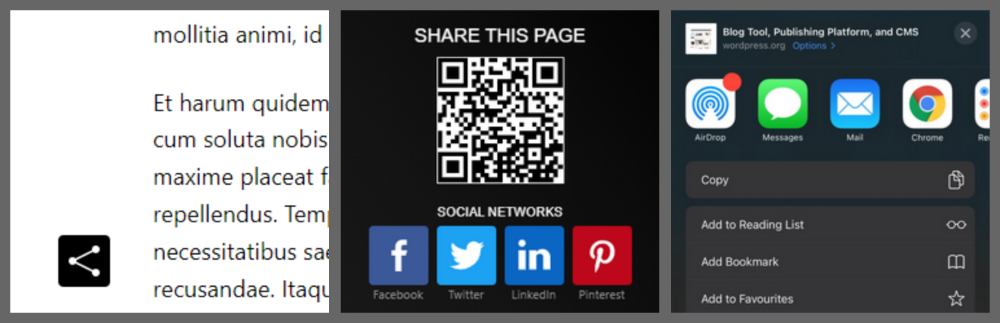
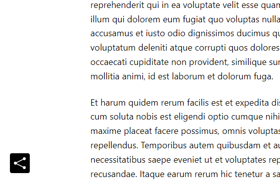
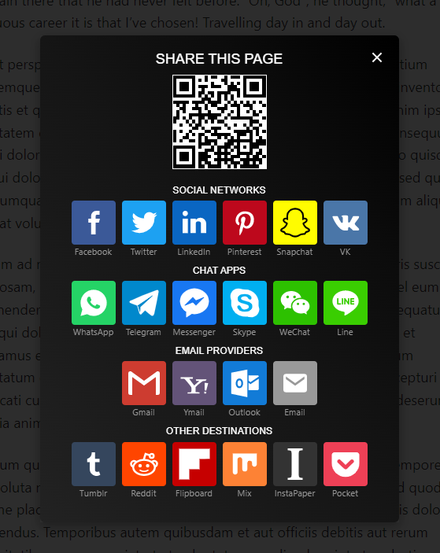
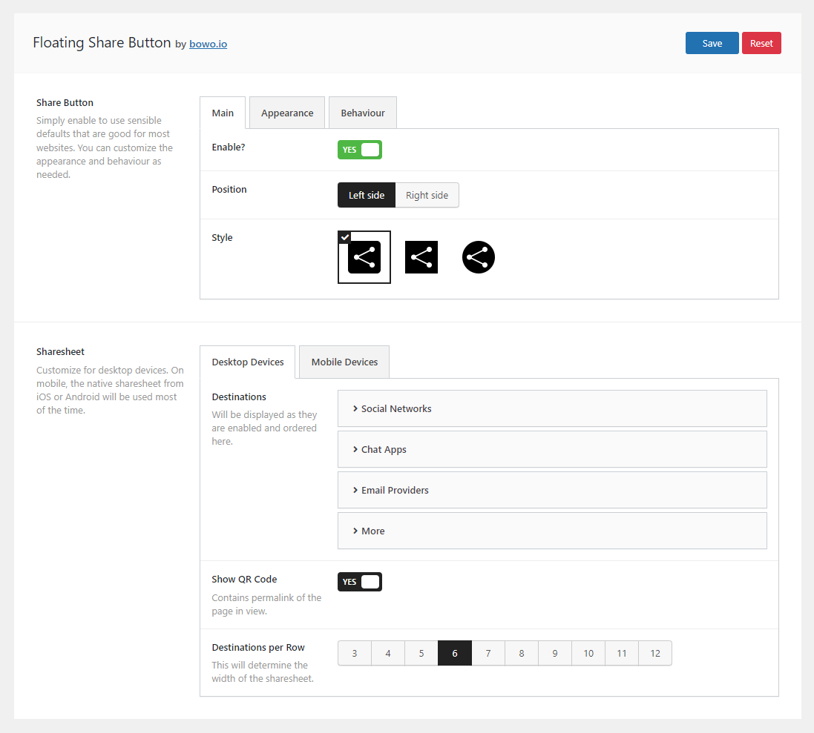
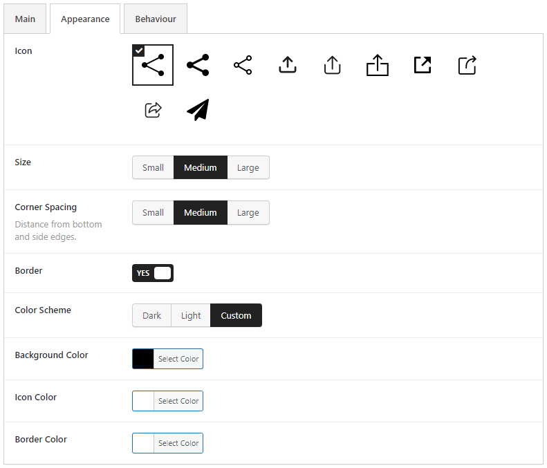
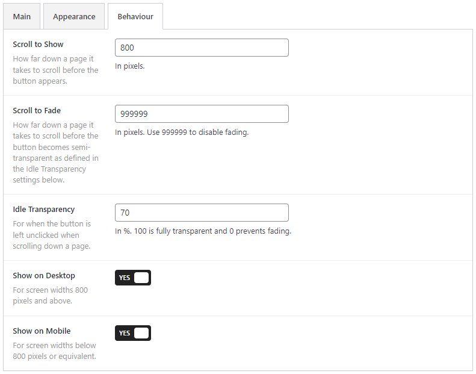
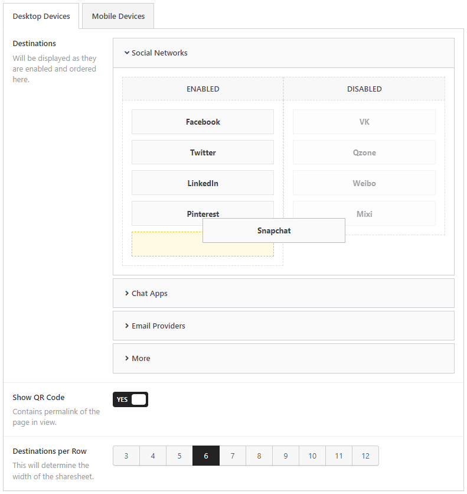
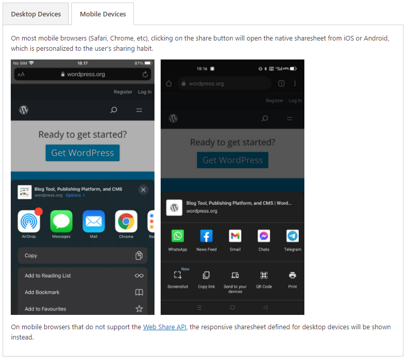

# Floating Share Button

Contributors: qriouslad  
Donate link: https://paypal.me/qriouslad
Tags: share button, floating share, scriptless share, web share api, native mobile share, ios android share  
Requires at least: 5.0  
Tested up to: 5.9.2  
Stable tag: 1.5.0  
License: GPLv2 or later  
License URI: http://www.gnu.org/licenses/gpl-2.0.html

Lightweight floating share button with responsive desktop sharesheet and native iOS and Android sharesheet.

## Description

This plugin enables a floating share button that triggers a responsive, customizable sharesheet on desktop devices and the native iOS or Android sharesheet on mobile devices using the [Web Share API](https://web.dev/web-share/).

### Features

* Lightweight. Minimal CSS and JS on the frontend with no jQuery dependency. Uses SVG icons. Very very minimal impact on website load time.
* Supports 33 of the most popular sharing destinations, including social networks, chat apps, email apps, social bookmarking sites, etc.
* The appearance of the floating button can be customized to match the design of your website.
* Great tandem with the [Flexible Scroll Top](https://wordpress.org/plugins/flexible-scroll-top/) plugin. Works beatifully on both desktop and mobile devices, especially if you are looking for a minimalist approach.

### Give Back

* [Github repo](https://github.com/qriouslad/floating-share-button) to contribute code.
* [PayPal.me](https://paypal.me/qriouslad) to fuel my dev work with a supply of milk tea.
* [A nice review](https://wordpress.org/plugins/floating-share-button/#reviews) would be great!

## Screenshots

1. The default floating share button  
   
2. The responsive desktop sharesheet  
   
3. The main settings page  
   
4. Customizing the appearance  
   
5. Customizing the behaviour  
   
6. Customizing the desktop sharesheet  
   
7. Screenshots of the native iOS and Android sharesheet  
   

## Frequently Asked Questions

### How was this plugin built?

Flexible Scroll top was built with: [WordPress Plugin Boilerplate](https://github.com/devinvinson/WordPress-Plugin-Boilerplate/) | [wppb.me](https://wppb.me/) | [CodeStar framework](https://github.com/Codestar/codestar-framework) | [CodyFrame](https://github.com/CodyHouse/codyhouse-framework) | [bulma](https://bulma.io/) | Icons from [IconFinder.com](https://www.iconfinder.com/).

## Changelog

### 1.5.0 (April 2022)

* Implement custom corner spacing option
* Fix sizing issue with image select buttons due to css conflict 

### 1.4.2 (April 2022)

* Modify button z-index property so it stays on top of other elements on the page

### 1.4.1 (March 2022)

* Increase [QR code version](https://www.qrcode.com/en/about/version.html) from 5 to 8 to acommodate conversion of longer URL

### 1.4.0 (March 2022)

* Add dark and light mode for the sharesheet

### 1.3.1 (March 2022)

* Add background hover color settings
* Fix footer link to plugin page on wordpress.org

### 1.2.0 (March 2022)

* Security hardening by properly escaping output

### 1.1.0 (March 2022)

* Implement local QR code generator using chillerlan/php-qrcode library

### 1.0.0 (February 2022)

* Initial release